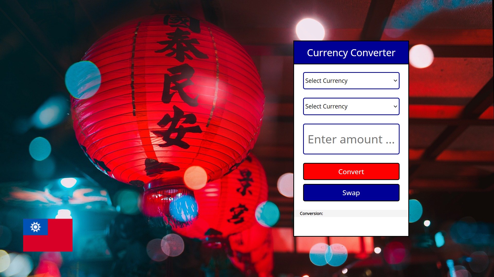

# The Dream :airplane:
In this challenge I had to choose a country I would like to travel to and create a simple currency convertor. I chose Taiwan and in my convertor you will be able to convert TWD to USD and EUR.

This challenge was provided to me by [BeCode](https://github.com/becodeorg).

## :pushpin: Result
At the moment I don't know how to deploy a page coded in PHP. 

Anyway ... here is an image of my converter:

## :wrench: Tools
- Visual Studio Code
- MAMP
- Languages: HTML, CSS, PHP